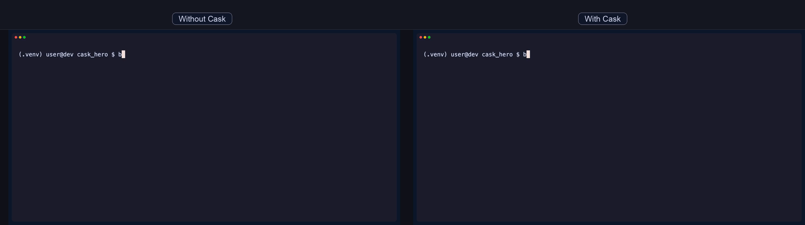
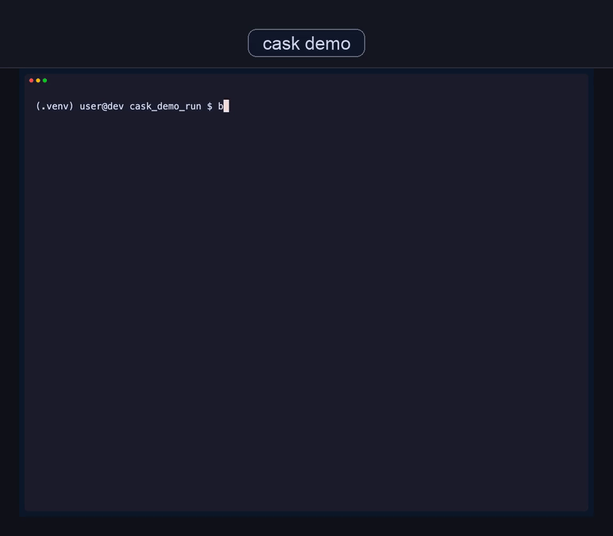

[](https://pypi.org/project/caskmcp/)
[](https://pypi.org/project/caskmcp/)
[](LICENSE)
[](https://github.com/caskmcp/CaskMCP/actions/workflows/ci.yaml)

# Cask — Governed AI agent tools from real API traffic

<!-- mcp-name: io.github.caskmcp/cask -->

Turn any web API into a governed, agent-ready MCP server. Lockfile-based approval, fail-closed enforcement, self-repairing proposals, and full audit trail. Every tool your AI agent uses is reviewed, signed, and traceable.

<!-- hero-start -->
<p align="center">
  
</p>
<!-- hero-end -->

## The Problem

AI agents need tools. MCP gives them tools. But **who governs what those tools can do?**

Without governance, agents silently call admin endpoints, charge billing APIs, leak data to third parties, and escalate their own privileges — with no audit trail and no way to detect drift. [OpenAI warns about tool-injection risks](https://platform.openai.com/docs/mcp). [Real data exposure incidents are already happening](https://www.upguard.com/blog/asana-discloses-data-exposure-bug-in-mcp-server).

Cask is the missing governance layer: **local, deterministic, auditable, fail-closed.**

## See It Work (30 seconds)

```bash
pip install caskmcp
cask demo
```

<p align="center">
  
</p>

`cask demo` compiles 8 tools from bundled API traffic, enforces fail-closed lockfile governance, proves deterministic replay parity, and emits evidence artifacts. Exit code `0` means every governance gate held.

## Quick Start (5 minutes)

**Prerequisites:** Python 3.11+

```bash
# 1. Initialize cask in your project
cask init

# 2. Capture traffic and compile a governed toolpack
cask mint https://your-app.com -a api.your-app.com

# 3. Review what changed (risk-classified diff)
cask diff --toolpack .caskmcp/toolpacks/*/toolpack.yaml

# 4. Approve tools for use (interactive TUI or CLI)
cask gate allow --all

# 5. Start the governed MCP server
cask serve --toolpack .caskmcp/toolpacks/*/toolpack.yaml
```

Your AI agent now has governed, auditable access to your API.

## How It Works

```
  Capture ─── Compile ─── Review ─── Approve ─── Serve ─── Verify
    │            │           │          │           │          │
  HAR/OTEL    tools.json   cask diff  lockfile   MCP stdio  contracts
  OpenAPI     policy.yaml            signatures              drift
  Browser     contracts                                      evidence
  WebMCP      scopes                                         repair
```

**Capture** real traffic (HAR, OpenTelemetry, OpenAPI specs, live browser, or WebMCP discovery).
**Compile** into deterministic, versioned tool definitions with risk classification and scopes.
**Review** changes with `cask diff` — every new tool, schema change, or host addition is risk-classified.
**Approve** via Ed25519-signed lockfile entries — explicit human decisions, not silent defaults.
**Serve** through MCP with fail-closed enforcement — unapproved tools never execute.
**Verify** with contracts, drift detection, and evidence bundles. When things break, `cask repair` proposes fixes.

## What Makes Cask Different

### Fail-Closed by Default
No lockfile, no runtime. Period. This isn't a suggestion — it's an architectural invariant. Unapproved tools never execute, and there's no way to bypass it.

### Self-Repairing Governance
When agents are denied capabilities, `cask repair` diagnoses the issue from audit logs, drift reports, and verification failures, then proposes classified fixes:
- **SAFE** — read-only diagnostics (auto-runnable)
- **APPROVAL_REQUIRED** — grants new capability (needs human review)
- **MANUAL** — requires investigation or re-capture

Agents can also propose new capabilities via `cask propose` — proposals are stored as drafts and only promoted to runtime by explicit human approval.

### Interactive TUI
Rich terminal UI for tool review — risk-colored tables, wizard flows, typed confirmation for dangerous operations. Run `cask` with no arguments for a guided menu.

### Agent-Aware Introspection
`cask inspect` runs a read-only Meta MCP server that exposes governance state as AI-consumable tools. Agents can query what they're allowed to do, check policy, and list pending approvals — making them governance-aware.

### Deterministic Replay Parity
Same inputs produce identical artifacts, digests, and tool outputs. This is verified, not aspirational — `cask demo` proves it in 30 seconds.

### Full Audit Trail
Every governance decision (ALLOW, DENY, CONFIRM) is logged with structured traces. Every approval is Ed25519-signed. Every verification run produces an evidence bundle with SHA-256 digests.

## Traffic Capture

Start where you already are:

| You have | Command | Best for |
| --- | --- | --- |
| Nothing (just exploring) | `cask demo` | Fastest first run, no credentials needed |
| A web app to capture | `cask mint https://app.example.com -a api.example.com` | Capturing real authorized behavior |
| HAR/OTEL files | `cask capture import traffic.har -a api.example.com` | Adopting Cask without recapturing |
| An OpenAPI spec | `cask capture import openapi.yaml -a api.example.com` | Generating tools from specs |

All paths converge to the same governed runtime.

## Core Commands

| Command | What it does |
| --- | --- |
| `cask init` | Initialize Cask in your project |
| `cask mint <url>` | Capture traffic and compile a governed toolpack |
| `cask gate allow/block/check/status` | Approve, block, or audit tools via signed lockfile |
| `cask serve` | Start the governed MCP server (stdio) |
| `cask diff` | Generate a risk-classified change report |
| `cask drift` | Detect API surface changes against a baseline |
| `cask verify` | Run verification contracts (replay, outcomes, provenance) |
| `cask repair` | Diagnose issues and propose classified fixes |
| `cask propose` | Manage agent draft proposals for new capabilities |
| `cask inspect` | Start read-only Meta MCP for agent introspection |
| `cask config` | Generate MCP client config (Claude Desktop, Codex) |
| `cask demo` | Prove governance works (offline, 30 seconds) |

> **Tip:** Run `cask` with no arguments for an interactive guided menu. Use `cask --help-all` to see all 25+ commands including `compliance`, `bundle`, `enforce`, `confirm`, and more.

## Runtime Enforcement

The MCP server enforces multiple safety layers on every tool call:

- **Lockfile approval** — only explicitly approved tools execute
- **Policy evaluation** — priority-ordered rules (allow, deny, confirm, budget, audit)
- **Rate limiting** — per-minute/per-hour budgets with sliding-window tracking
- **Network safety** — SSRF protection, metadata endpoint blocking, redirect validation
- **Confirmation flow** — HMAC-signed out-of-band challenge tokens for sensitive operations
- **Redaction** — strips auth headers, tokens, PII from all captured data by default
- **Dry-run mode** — evaluate policy without executing upstream calls

## Installation

**Prerequisites:** Python 3.11+

```bash
# Base install (includes offline demo)
pip install caskmcp

# With MCP server support
pip install "caskmcp[mcp]"

# With live browser capture
pip install "caskmcp[playwright]"
python -m playwright install chromium

# Everything
pip install "caskmcp[all]"
```

## MCP Client Config

Generate a config snippet for your AI client:

```bash
# For Claude Desktop
cask config --toolpack .caskmcp/toolpacks/*/toolpack.yaml --format json

# For Codex
cask config --toolpack .caskmcp/toolpacks/*/toolpack.yaml --format codex
```

Or add this to your Claude Desktop config (`~/.claude/claude_desktop_config.json`):

```json
{
  "mcpServers": {
    "my-api": {
      "command": "cask",
      "args": ["serve", "--toolpack", "/path/to/toolpack.yaml"]
    }
  }
}
```

## Documentation

- [User Guide](docs/user-guide.md) — full command reference and workflows
- [Architecture](docs/architecture.md) — system design and component specs
- [Glossary](docs/glossary.md) — key terms and concepts
- [Troubleshooting](docs/troubleshooting.md) — common issues and fixes
- [Known Limitations](docs/known-limitations.md) — runtime and capture caveats
- [Publishing](docs/publishing.md) — PyPI release process

## Contributing

See [CONTRIBUTING.md](CONTRIBUTING.md) for development setup, TDD policy, and pull request process.

```bash
git clone https://github.com/caskmcp/CaskMCP.git
cd CaskMCP/cask
pip install -e ".[dev,packaging-test]"
pytest tests/ -v
```

## License

[MIT](LICENSE)
